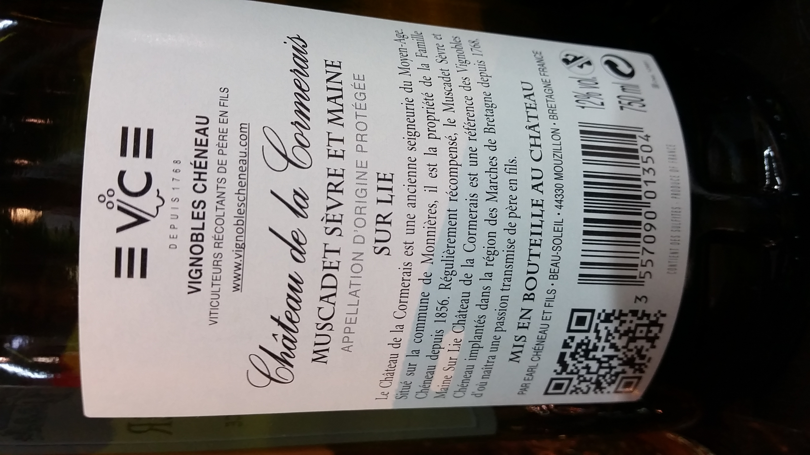

Microsoft Computer Vision API Bundle for Symfony
================================================



>"o DEPUIS 1768 VIGNOBLES CHÉNEAU VITICULTEURS RÉCOLTANTS DE PÈRE EN FILS www.vignoblescheneau.com MUSCADET SÈVRE ET MAINE APPELLATION D'ORIGINE PROTÉGÉE SUR LIE Château de la Cormerais est une ancienne seigneurie du Moyen-Age Situé sur la commune de Monnières, il est la propriété de la Famille Chéneau depuis 1856. Régulièrement récompensé, le Muscadet Sèvre et Maine Sur Lie Château de la Cormerais est une référence des Vignobles Chéneau implantés dans la région des Marches de Bretagne depuis d oil naitra une passion transmise de père en fils. EN BOUTEILLE AU CHÂTEAU ET FILS • BEAU-SOLEIL • 44330 MOUZILLON • BRETAGNE 3 557090 013504"

Service presentation
--------------------

With [Microsoft's Computer Vision API](https://www.microsoft.com/cognitive-services/en-us/computer-vision-api) users can analyze images to use optical character recognition to identify text found in images, directly from a Symfony project.

The cloud-based Computer Vision API provides developers with access to advanced algorithms for processing images and returning information. By uploading an image or specifying an image URL, Microsoft Computer Vision algorithms can analyze visual content in different ways based on inputs and user choices. 

The OCR is available:
- as a service, available in your Symfony's dependency injection container 
- as a command line tool, with arguments and options (see below)

Supported locales
-----------------

The 21 languages supported by OCR are Chinese Simplified, Chinese Traditional, Czech, Danish, Dutch, English, Finnish, French, German, Greek, Hungarian, Italian, Japanese, Korean, Norwegian, Polish, Portuguese, Russian, Spanish, Swedish, and Turkish. 

Accuracy
--------

The accuracy of text recognition depends on the quality of the image. An inaccurate reading may be caused by the following:

- Blurry images
- Handwritten or cursive text
- Artistic font styles
- Small text size
- Complex backgrounds, shadows or glare over text or perspective distortion
- Oversized or missing capital letters at the beginnings of words
- Subscript, superscript, or strikethrough text

Limitations 
-----------

On photos where text is dominant, false positives may come from partially recognized words. On some photos, especially photos without any text, precision can vary a lot depending on the type of image.

- Small text size
- Complex backgrounds, shadows or glare over text or perspective distortion
- Oversized or missing capital letters at the beginnings of words
- Subscript, superscript, or strikethrough text


- [Computer Vision API overview](https://www.microsoft.com/cognitive-services/en-us/computer-vision-api)
- [Computer Vision API documentation](https://westus.dev.cognitive.microsoft.com/docs/services/56f91f2d778daf23d8ec6739/operations/56f91f2e778daf14a499e1fc)


Installation
============

Download the Bundle
-------------------

Open a command console, enter your project directory and execute the
following command to download the latest stable version of this bundle:

```console
$ composer require openwines/computer-vision-bundle "dev-master"
```

This command requires you to have Composer installed globally, as explained
in the [installation chapter](https://getcomposer.org/doc/00-intro.md)
of the Composer documentation.

Enable the Bundle
-----------------

Then, enable the bundle by adding it to the list of registered bundles
in the `app/AppKernel.php` file of your project:

```php
<?php
// app/AppKernel.php

// ...
class AppKernel extends Kernel
{
    public function registerBundles()
    {
        $bundles = array(
            // ...

            new OpenWines\ComputerVisionBundle\OpenWinesComputerVisionBundle(),
        );

        // ...
    }

    // ...
}
```

Then create your API key: https://www.microsoft.com/cognitive-services/en-us/computer-vision-api

And copy it in `app/config/parameters.yml`:

```yaml
    parameters:
        (...)
        microsoft_computer_vision.api_token: aSecretTokenNotToPushOnGithub
```

Use it as a service
-------------------

The service is available in your dependency injection container (`openwines_computer_vision.client`):

```php
$result = $this
              ->getContainer()
              ->get('openwines_computer_vision.client')
              ->process(
                  $input->getArgument('source'), // a file or a folder
                  $input->getArgument('lang')    // fr, en, unk (auto-detect if unknown), etc. See doc link above
          );
```

Use it in Command-line
----------------------

Perform an OCR on `vendor/openwines/computer-vision-bundle/src/OpenWines/ComputerVisionBundle/Resources/data/wines/`
and put the result in a `./wines.csv` file:

```console
Usage:
  cv:ocr [options] [--] <source> <lang>

Arguments:
  source                base64 encoded, URL, or absolute path. Single image or folder.
  lang                  The BCP-47 language code of the text to be detected in the image. The default value is "unk", then the service will auto detect the language of the text in the image.

Options:
  -o, --output=OUTPUT   The optional CSV file output path
  -h, --help            Display this help message
  -q, --quiet           Do not output any message
  -V, --version         Display this application version
      --ansi            Force ANSI output
      --no-ansi         Disable ANSI output
  -n, --no-interaction  Do not ask any interactive question
  -e, --env=ENV         The environment name [default: "dev"]
      --no-debug        Switches off debug mode
  -v|vv|vvv, --verbose  Increase the verbosity of messages: 1 for normal output, 2 for more verbose output and 3 for debug

Help:
  This command allows you to perform Optical Character Recognition (OCR) method over an image,
  to detect text in an image and extract recognized characters into a machine-usable character stream.
  the OCR results are returned include include text, bounding box for regions, lines and words

  Computer Vision API overview: https://www.microsoft.com/cognitive-services/en-us/computer-vision-api
  Computer Vision API documentation: https://westus.dev.cognitive.microsoft.com/docs/services/56f91f2d778daf23d8ec6739/operations/56f91f2e778daf14a499e1fc

Example:

php bin/console cv:ocr -o ./wines.csv vendor/openwines/computer-vision-bundle/src/OpenWines/ComputerVisionBundle/Resources/data/wines/ fr 
cat wines.csv
```
